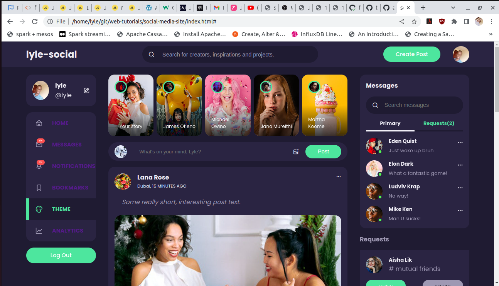

# photo-sharing-app

> An application for sharing photos with your friends.

<p align="center">
  
  
  
  
  
  
  
  
  
  
  
  
  
  
  
</p>

## Application Overview

This is a social application that enables an authenticated and authorized user to share images and short messages with their friends. It is a responsive single page application built with python,flask, html, javascript and css.



## Application Demo

The application supports the following operations:

1. Account creation using a username and email address.
2. Logging in and out
3. Updating user information including he user password.
4. Creating, viewing, deleting and updating posts which consist of an image andsome text.
5. Reacting to posts, including liking and commenting.
6. Sending private messages to other users.

<p align=center>
  
</p>

## Local Setup

To work with the applicatio locally:

1. Clone the project repo:

  ```sh
  git clone
  ```